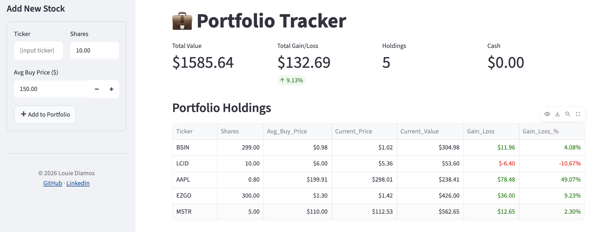
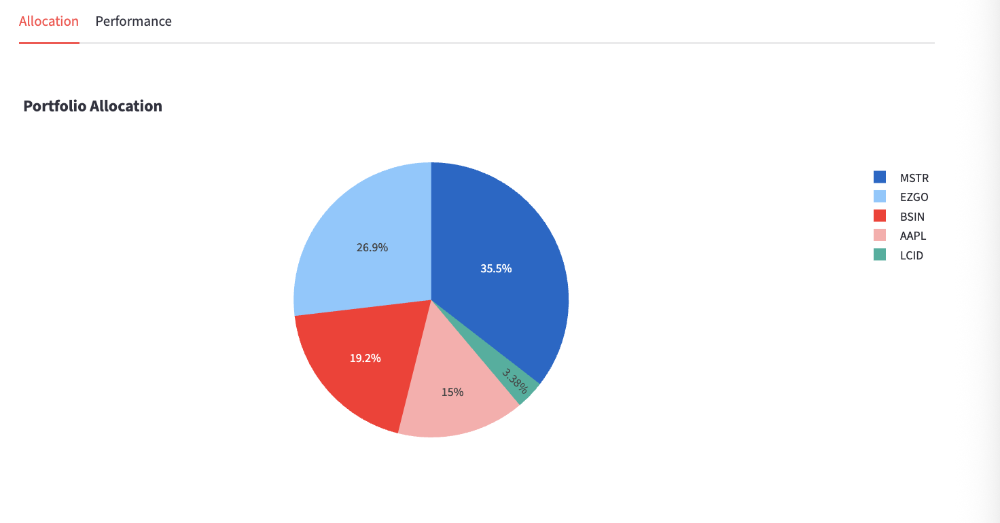
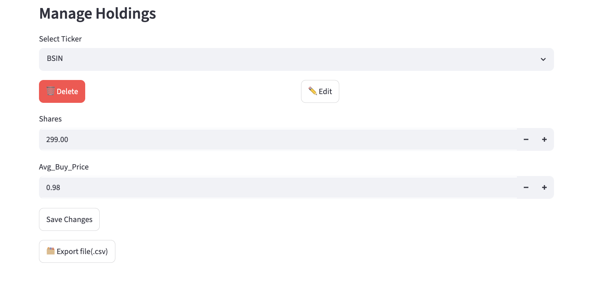

# 💼 Portfolio Tracker
A clean, interactive web-based **Stock Portfolio Management Tool** with real-time pricing and performance chart visualizations, built for the **Google Data Analytics Professional Certificate**.

## 🎯 Objectives

## General Objective:
To provide an efficient and user-friendly web-based tool to manage portfolio holdings and show timely performance and relevant metrics.

### Specific Objectives:
- To be able to Add, Edit, Delete stock holdings 
- To show the performance of the Portfolio using Visual Insights
- To provide spreadsheet data storage persistence

🔗 **Live Demo:** [Launch App](https://louie-diamos-portfolio-tracker.streamlit.app/) <br>
🎓 **Certificate:** [View Certificate](https://www.coursera.org/account/accomplishments/specialization/VGC1N9Q9HPBD)

---
## 📸 Screenshots




## ✨ Features
- Add, edit, and delete stock holdings
- Real-time price tracking via yfinance
- Portfolio Summary with Total Value, Gain/Loss
- Interactive Charts: Portfolio allocation(pie) and 30-Day performance(line)
- Persistent storage via Google Sheets API
- CSV export option

## 🛠️ Tech Stack
**Frontend**: Streamlit<br>
**Data Processing**: Pandas <br>
**Visualizations**: Plotly<br>
**Stock Data**: yfinance <br>
**Database**: Google Sheets API (gspread)<br>
**Deployment**: Streamlt Community Clouid<br>
**Version Control**: Git and GitHub<br>

## 🏗️ Architecture
The web-based tool is hosted on Streamlit for its frontend. Steamlit provides a clean user interface for the Portfolio management system: Header, Sidebar to Add, Select Box to Delete and Edit holdings, Tabs for Visual Charts, Title, and URL. 

The user session is provided by Streamit’s session_state function, where users can input their portfolio as they access the webpage. Then, the data are saved to a Google Sheet with API integration(JSON keys and gspread module) so they are accessible every time the Portfolio Tracker webpage is opened.

## 🐛 Challenges & Lessons Learned
- When first deployed to the cloud, data persistence was nonexistent since local testing utilized to_csv to create a local folder for the data input. This made all buttons - Add, Delete, Edit - unresponsive and not working at all since data was not stored.
- So I changed it to session_state so the data is interactive online for improvement of the response time, missing pricing, unresponsive buttons, and further debugging for the first major deployment. 
- This proved to be a great learning experience about data persistence using session_state, and to ensure data is saved, I integrated is to gspread using API and JSON credentials, which is now enabled.
- Uploading the repository to GitHub required careful steps to make sure the JSON credentials are not exposed by saving to .gitignore. 
- The Streamlit secret setup for JSON took some time since Streamlit has a strict requirement for the TOML format for the credentials to be accessible. 
- The second major deployment was the persistent data storage. I created a branch in GitHub gsheet-integration. This required several testing and, debugging, and refactoring of the portfolio_tracker.py. Now, the data is saved to a Google Sheet and reloaded when accessing the tool.

## 🚀 Running Locally
```bash
git clone https://github.com/louiediamos/Portfolio-Tracker.git
cd Portfolio-Tracker
pip install -r requirements.txt
streamlit run portfolio_tracker.py
```

Requires a `credentials.json` Google service account key for 
Sheets integration (see Setup below).

## ⚙️ Setup (Google Sheets API)
1. Create a Google Cloud account
2. Enable Google Sheet and Drive APIs
3. Generate and download the JSON key for local access
4. Upload JSON key to Streamlit > Secrets for cloud access
5. Refactor creds_dict and KEY_PATH in portfolio_tracker.py with your personal JSON key.
6. Save and Deploy

## 🔮 Future Enhancements
- PDF Parser for Trading Confirmation Report
- User authentication
- Multi-currency support
- Cash Balance Tracking

## 👤 Author
Louie Diamos<br>
Google Data Analytics Professional Certificate<br>
Aspiring Data Analyst | Finance Enthusiast<br>
[GitHub](https://github.com/louiediamos) · [LinkedIn](https://www.linkedin.com/in/ldiamos)
